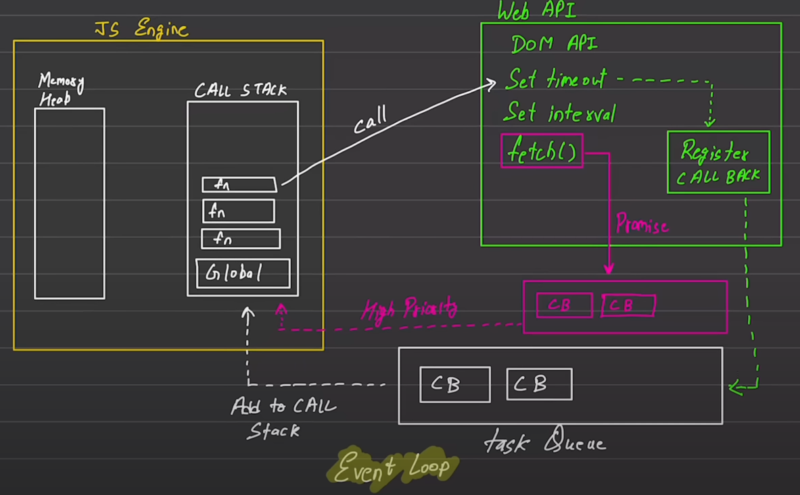

```
Javascript  
    -> Synchronous  
    -> Single Threaded  

Execution Context
    -> execute one line of code at a time                     
    
    CALL Stack      Memory Heap
```

```
Blocking Code  vs  Non-Blocking Code

Block flow of      Does not block 
program            execution

Read file sync     Read file Async
```

